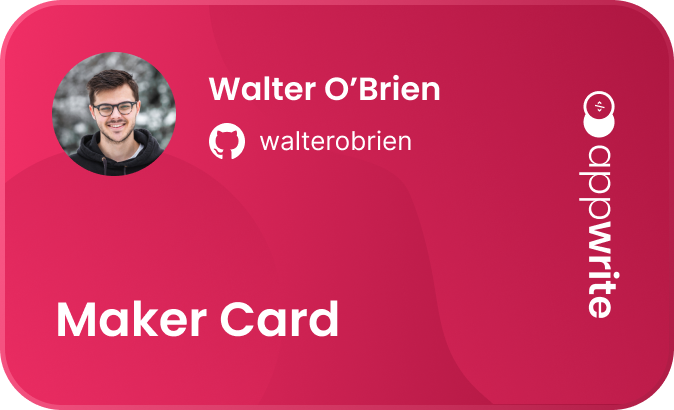

<svg fill="none" viewBox="0 0 800 400" width="800" height="400" xmlns="http://www.w3.org/2000/svg">
    <foreignObject width="100%" height="100%">
        

            <main class="svelte-12ravdr">
                

                    

                        <article class="svelte-1ahg0de">
                            

                                <h2 class="svelte-v4w3mo">Create Your Maker Card</h2>
                                
It doesn't matter if you've submitted a pull request, shared
                                    your frustration or love of our
                                    product, or recommended us to your peers, you all helped Appwrite reach this major
                                    milestone.
                                    This is why we want to list any of our community members who are interested along
                                    side our
                                    core team as makers.

                            

                        </article>
                        <figure class="svelte-kwk3gn">
                            

                        </figure>
                    

                

            </main>
        

    </foreignObject>
</svg>
